<!-- animated contribution graph: real data, boxes reveal cell by cell
     (regenerated daily by .github/workflows/update-profile-art.yml) -->

<h3><code>samurai124@github ~ $ ./contributions.sh</code></h3>

 
 

<!-- ascii portrait (left) + neofetch-style info panel (right) -->

<h3><code>samurai124@github ~ $ whoami</code></h3>

<table>
  <tr>
    <td valign="top"></td>
    <td valign="top"></td>
  </tr>
</table>

 
 

<h3><code>samurai124@github ~ $ ./links.sh</code></h3>

<b>Full-Stack Web Developer · React · Spring Boot · Laravel</b>

  
  &nbsp;
  
  &nbsp;
  

